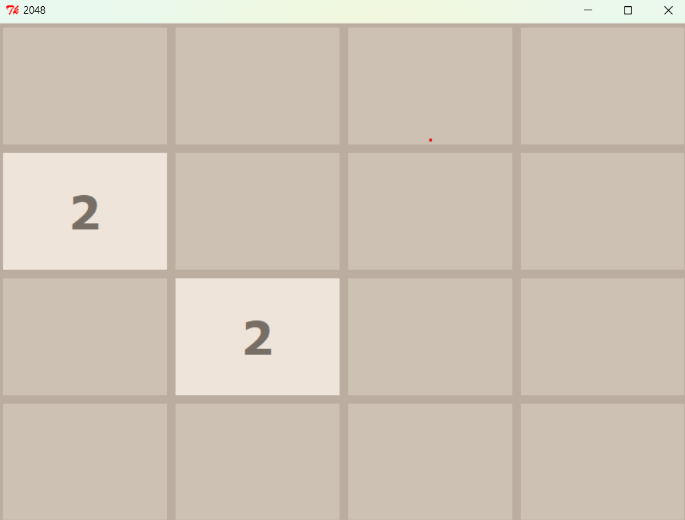
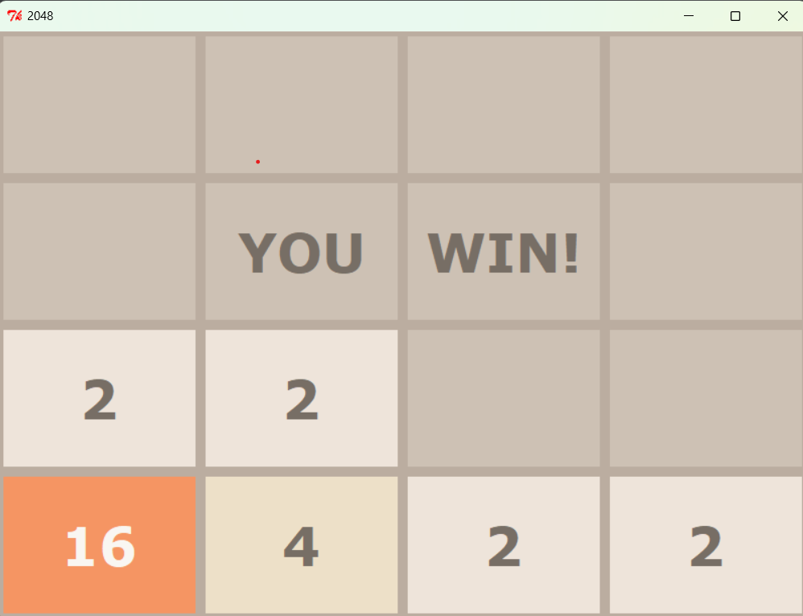
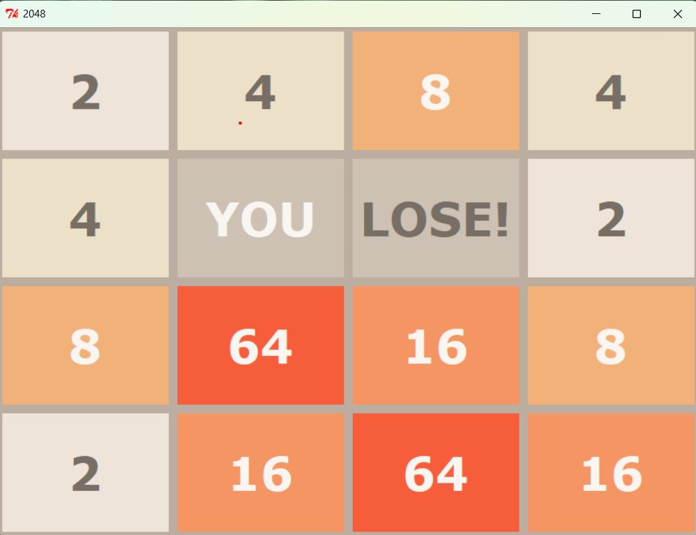

# 2048 Game

## Overview
Welcome to the 2048 Game, a classic number puzzle game implemented using Python and Tkinter. Merge the tiles to reach the 2048 tile!

## Features
- **Interactive Gameplay:** Enjoy a fully functional 2048 game with smooth controls and a responsive UI.
- **Customizable Design:** Unique color scheme for a visually appealing interface.
- **Optimized Performance:** Efficient performance for a seamless gaming experience.

## Screenshot







## Installation
Follow these steps to run the game on your local machine.

### Prerequisites
- Python 2.x installed on your system.
- Tkinter installed (usually comes pre-installed with Python).

### Steps
1. Clone the repository.

2. Run the game:
    ```bash
    python 2048.py
    ```

## How to Play
- **Objective:** Combine tiles with the same number to create a tile with the number 2048.
- **Controls:**
  - Use the `W`, `A`, `S`, `D` keys to move the tiles up, left, down, and right respectively.
  - When two tiles with the same number collide, they merge into one.

## Customization
You can customize the game's appearance by modifying the color scheme in the `2048.py` file. The colors for each tile value are defined in the `BACKGROUND_COLOUR_DICT` and `CELL_COLOR_DICT` dictionaries.


## Contact
Feel free to reach out if you have any questions or feedback:
- **LinkedIn:** [LinkedIn Profile](https://www.linkedin.com/in/ayushi-yadav-028bb21b6/)
- **Email:** [ayushi9723@example.com](ayushi9723@example.com)
